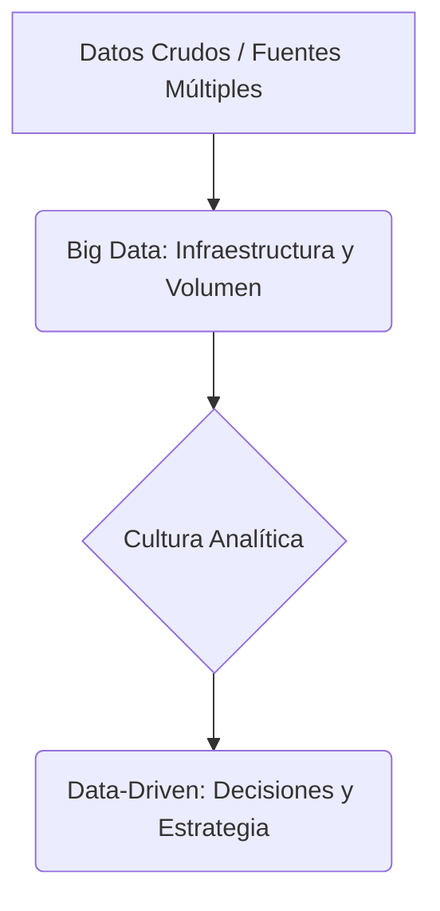
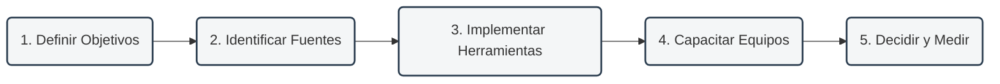

<table style="width: 100%; border: none; border-collapse: collapse; background-color: transparent;">
  <tr style="border: none; background-color: transparent;">
    <td style="width: 120px; border: none; padding: 10px; vertical-align: middle; background-color: transparent;">
      
    </td>
    <td style="border: none; padding: 10px; vertical-align: middle; line-height: 1.5; background-color: transparent;">
      <h2 style="margin: 0; color: #1e3a8a; font-family: Arial, sans-serif; font-weight: bold;">
        Pontificia Universidad Católica del Ecuador Sede Manabí
      </h2>
      <h3 style="margin: 5px 0 0 0; color: #475569; font-family: Arial, sans-serif; font-weight: normal;">
        Carrera de Ingeniería de Software
      </h3>
    </td>
  </tr>
</table>

---

# ¿Qué implica ser una compañía Data-Driven y cómo lograrlo?

* **Asignatura:** Prácticas en Gestión de la Información
* **Docente:** Ing. José Naranjo, M.Eng.
* **Período:** 2026-1 | Parcial 3

> [!NOTE]  
> **Tiempo estimado de lectura:** 10 minutos  
> **Enfoque:** Optimización de toma de decisiones y gobernanza de datos.

Las compañías **Data-Driven** (guiadas por datos) basan sus decisiones estratégicas y operativas en evidencia y análisis de datos en lugar de guiarse únicamente por la intuición o la experiencia acumulada. Esto les otorga una ventaja competitiva crítica para identificar patrones, predecir tendencias y reaccionar a tiempo.

---

## 1. Gobierno de Datos Aplicado

El Gobierno de Datos es el conjunto de políticas, procesos, estándares y métricas que aseguran que los datos se usen de manera eficiente, efectiva y segura dentro de una organización. No constituye una herramienta de software particular, sino una disciplina organizacional que transforma los datos de un recurso caótico a un activo estratégico. Su propósito fundamental es optimizar la toma de decisiones, garantizar el cumplimiento regulatorio y generar confianza institucional.

### 1.1. Roles y responsabilidades en Gobierno de Datos
Define la estructura organizativa y la asignación de responsabilidades sobre los activos de información para evitar la fragmentación y la falta de rendición de cuentas:
*   **Propietario del Dato (Data Owner):** Directivo responsable de definir las reglas de negocio, los presupuestos, los accesos y los objetivos estratégicos de un dominio de datos específico (por ejemplo, el Director de Marketing sobre la información de clientes).
*   **Administrador del Dato (Data Steward):** Perfil operativo y de enlace que asegura el cumplimiento de los estándares de calidad, la consistencia conceptual (definiciones uniformes) y la aplicación cotidiana de las directrices del propietario.
*   **Custodio del Dato (Data Custodian):** Responsable técnico (ingenieros de datos, administradores de bases de datos) encargado de implementar las medidas de seguridad, almacenamiento, respaldo, cifrado y accesos autorizados.

### 1.2. Catálogo de Datos y Linaje (Data Lineage)
Herramientas fundamentales para la visibilidad, gobernabilidad y trazabilidad de los flujos de información:
*   **Catálogo de Datos:** Inventario centralizado de metadatos (información descriptiva sobre los datos) que facilita la búsqueda y comprensión de los recursos informacionales de la organización (descripción de tablas, tipos de columnas, niveles de acceso y estado de producción).
*   **Linaje de Datos (Data Lineage):** Mapa gráfico e histórico que describe la trazabilidad del dato desde su origen (fuente transaccional), pasando por sus etapas de transformación y limpieza, hasta su destino final (reportes o tableros de Business Intelligence). Facilita el análisis de impacto y la auditoría de errores.

### 1.3. Privacidad y Cumplimiento: Datos Personales, Anonimización y Pseudonimización
Mecanismos de control ético y legal para proteger los datos personales según las normativas vigentes (ej. GDPR, leyes locales de protección de datos personales):
*   **Pseudonimización:** Técnica reversible que consiste en reemplazar identificadores directos (ej. cédula de identidad, nombre completo) por un seudónimo. Permite realizar análisis segmentados manteniendo la posibilidad de reidentificación bajo condiciones controladas de seguridad.
*   **Anonimización:** Proceso irreversible mediante el cual se modifican o agregan los datos de manera que resulte imposible identificar al titular, incluso mediante cruces de bases de datos. Es ideal para investigación y análisis estadístico libre.

### 1.4. Taller Práctico: Diseño de un Catálogo de Datos Universitario
Simulación práctica para aplicar los conceptos teóricos en una entidad de educación superior:
*   **Fase 1: Identificación de fuentes:** Mapeo de sistemas (académico, biblioteca, financiero, encuestas).
*   **Fase 2: Definición de metadatos:** Estructuración de tablas clave (ej. estudiante, matrícula) con sus tipos y seudónimos.
*   **Fase 3: Clasificación de sensibilidad:** Niveles de acceso según la confidencialidad de la información.
*   **Fase 4: Asignación de roles y linaje:** Determinación de responsables (Steward, Custodian) y trazabilidad del flujo de reportes académicos.

### 1.5. Calidad de Datos (Data Quality)
Metodologías para medir y mantener la utilidad y confiabilidad de los datos basándose en dimensiones críticas de calidad:
*   **Dimensiones de Calidad:**
    *   *Exactitud:* Grado en que los datos representan de manera veraz la realidad que describen.
    *   *Integridad:* Ausencia de registros o campos nulos en variables críticas del negocio.
    *   *Consistencia:* Concordancia de los mismos datos en diferentes bases de datos o sistemas de la organización.
    *   *Actualidad:* Frecuencia y oportunidad de actualización del dato respecto al momento de su consulta.
*   **Monitoreo:** Establecimiento de indicadores clave (porcentaje de inconsistencias, tasas de error) para corregir desviaciones.

### 1.6. Gestión del Ciclo de Vida del Dato y Archivado (Data Lifecycle)
Políticas de gobernanza respecto a la temporalidad y disposición final de la información:
*   **Fases del Ciclo:** Creación/captura, almacenamiento, uso/análisis, archivado e inactivación, y eliminación segura.
*   **Políticas de Retención:** Definición de los tiempos de almacenamiento exigidos por ley o política interna antes de realizar la depuración para optimizar costes de almacenamiento y mitigar riesgos legales de sobreexposición de datos.

---

## 2. Conceptos Fundamentales: Big Data vs. Data-Driven

Es común confundir estos términos, pero representan aspectos diferentes:

*   **Big Data:** Se refiere al **volumen, velocidad y variedad** de los datos acumulados. Es la tecnología y la infraestructura de almacenamiento.
*   **Data-Driven:** Es el **enfoque y la cultura organizacional** de cómo se analizan y aplican esos datos para ejecutar acciones comerciales inteligentes.

---

## 3. Seis Características Clave de una Empresa Data-Driven

1.  **Cultura de Análisis:** Los datos están democratizados. Colaboradores de todos los niveles los entienden y los usan para justificar acciones.
2.  **Recopilación Sistemática:** Uso de sistemas integrados para capturar datos de diversas fuentes (clientes, finanzas, operaciones).
3.  **Análisis Avanzado:** Aplicación de estadística y aprendizaje automático para detectar patrones ocultos.
4.  **Decisiones Basadas en Evidencia:** La planificación estratégica y la operación diaria se sustentan en métricas validadas.
5.  **Mejora Continua:** Medición constante de objetivos (KPIs) para evaluar el éxito de cada iniciativa.
6.  **Inversión Tecnológica:** Incorporación de herramientas de visualización (BI) y digitalización de flujos de trabajo (como firmas electrónicas y gestión de contratos - CLM).

---

## 4. Ruta de Cinco Pasos para la Transformación Data-Driven

1.  **Definir objetivos comerciales:** Identificar qué problema de negocio se quiere resolver y cómo los datos pueden ayudar a solucionarlo.
2.  **Identificar fuentes de datos:** Localizar la información relevante, tanto interna (CRM, ERP, registros de venta) como externa (redes sociales, mercado).
3.  **Implementar herramientas de análisis:** Adoptar software de Business Intelligence (BI) y plataformas de visualización de datos.
4.  **Capacitar y estructurar equipos:** Formar a los colaboradores y contar con especialistas (analistas y científicos de datos).
5.  **Tomar decisiones y medir el impacto:** Asegurarse de que toda acción correctiva parta de un análisis previo y evaluar su impacto con métricas.

---

## 5. Ejercicio Práctico: Auditoría de Datos y Formulación de Hipótesis
*Tiempo estimado: 60 minutos | Formato: Individual o en equipo*

Este ejercicio ayuda a comprender cómo pasar de un problema de negocio abstracto a una solución basada en datos concretos.

### **Caso de Estudio: Fricción en el Cierre de Ventas**
**Contexto:** La empresa ha detectado que, a pesar de tener muchos clientes interesados, un gran porcentaje abandona la compra en la fase de firma de contratos y cierre administrativo.

#### **Paso 1: Inventario y Diagnóstico de Datos (20 minutos)**
El estudiante debe diagnosticar qué información tiene la empresa y qué información le hace falta para entender la raíz de un problema.

*   **Ejemplo de Referencia (Caso: Fricción en Ventas):**
    
    | Dimensión | Datos Disponibles (¿Qué tenemos?) | Datos Faltantes (¿Qué necesitamos?) | Fuente de Obtención |
    | :--- | :--- | :--- | :--- |
    | **Comportamiento del Cliente** | Tasa de abandono de propuesta. | Motivos específicos de la deserción. | Encuestas breves de salida / Post-venta. |
    | **Eficiencia del Proceso** | Fecha de envío del contrato. | Tiempo que tarda el cliente en firmar. | Logs del gestor de firma digital. |
    | **Calidad del Servicio** | Número de quejas registradas. | Nivel de satisfacción (NPS) del onboarding. | CRM de soporte. |

# RESOLUCIÓN - KAROLAYN BUÑAY

*   **Tu Turno (Actividad del Estudiante):**
   El problema de negocio seleccionado es la fricción en la firma de contratos y el cierre administrativo, debido a que muchos clientes interesados abandonan la compra durante esta etapa.:

    | Dimensión | Datos Disponibles (¿Qué tenemos?) | Datos Faltantes (¿Qué necesitamos?) | Fuente de Obtención |
    | :--- | :--- | :--- | :--- |
    | **Comportamiento / Acción** | *Cantidad de propuestas aceptadas, contratos enviados, contratos firmados y oportunidades marcadas como perdidas en el CRM.* | *Motivo exacto del abandono, paso donde se detuvo el cliente, canal utilizado, dudas presentadas y número de recordatorios recibidos.* | *CRM, encuesta breve de salida, entrevistas a clientes y analítica del portal de firma.* |
    | **Eficiencia del Proceso** | *Fecha de aceptación de la propuesta, fecha de envío del contrato, estado final y responsable comercial.* | *Tiempo que tarda el cliente en firmar, número de correcciones, documentos solicitados y errores técnicos o administrativos.* | *Registros del gestor de contratos, plataforma de firma electrónica, ERP y mesa de ayuda.* |
    | **Calidad / Satisfacción** | *Quejas, correos, llamadas y casos de soporte relacionados con el cierre.* | *Nivel de satisfacción del cliente, claridad percibida del contrato, facilidad del proceso y comentarios sobre la atención recibida.* | *Encuesta automática después de firmar o abandonar, CRM de soporte y revisión de comentarios.* |

---

#### **Paso 2: Formulación de Hipótesis (15 minutos)**
El estudiante debe conectar una métrica con una acción concreta de mejora para resolver el problema.

*   **Ejemplo de Referencia:**
    > *"Si analizamos el **tiempo de firma de contratos** y optimizamos el flujo usando **firma electrónica**, entonces lograremos **reducir el abandono de clientes en un 15%** debido a la **eliminación de fricciones físicas**."*

# RESOLUCIÓN - KAROLAYN BUÑAY

*   **Tu Turno (Actividad del Estudiante):**
    > *"Si analizamos el **tiempo que tardan los clientes en firmar los contratos** y optimizamos el **proceso de firma y cierre administrativo mediante la firma electrónica y recordatorios automáticos**, entonces lograremos **reducir el abandono de clientes en un 15 %**, debido a la **disminución de los tiempos de espera, los errores administrativos y las dificultades durante el proceso de cierre**."*

---

#### **Paso 3: Definición de KPIs y Métricas de Éxito (15 minutos)**
El estudiante debe definir cómo medirá si su hipótesis y acciones son correctas.

*   **Ejemplo de Referencia:**
    1.  *Ciclo de Firma de Contrato (días promedio).*
    2.  *Tasa de Conversión de propuestas enviadas a firmadas.*
    3.  *NPS del cliente durante el cierre de ventas.*

*   **Tu Turno (Actividad del Estudiante):**
    Escribe 3 KPIs cuantitativos o cualitativos para medir el éxito de tu hipótesis:
    1.  *KPI 1: [Escribe aquí...]*
    2.  *KPI 2: [Escribe aquí...]*
    3.  *KPI 3: [Escribe aquí...]*

---

#### **Paso 4: Plan de Acción Basado en Datos (10 minutos)**
El estudiante debe proponer una acción de mejora automatizada u operativa si los datos muestran que no se cumple el objetivo.

*   **Ejemplo de Referencia:**
    *Si el tiempo de firma supera los 5 días, se activará una secuencia de recordatorios automáticos y asistencia telefónica personalizada.*

*   **Tu Turno (Actividad del Estudiante):**
    Propón una acción concreta que se activará cuando tus KPIs muestren un rendimiento deficiente:
    *   *Acción Correctiva: [Escribe aquí...]*

---

## 6. Tarea de Investigación: Impacto de las Decisiones Basadas en Datos (DDD)
*Tiempo estimado: 45 minutos | Formato: Individual*

Para profundizar en el impacto real y cuantificable de la gobernanza y análisis de datos en las organizaciones, realiza la siguiente investigación académica.

### **Instrucciones:**
1. **Búsqueda del Paper:** Localiza el artículo de investigación clásico de los autores Erik Brynjolfsson, Lorin M. Hitt y Heekyung Hellen Kim titulado:
   > **"Strength in Numbers: How Does Data-Driven Decisionmaking Affect Firm Performance?"** (disponible en bases de datos académicas como Google Scholar o SSRN).
2. **Análisis y Reflexión:** Lee el resumen (Abstract) y las conclusiones del artículo, y responde a las siguientes preguntas:
   * **Pregunta 1:** ¿Cuál es el impacto porcentual estimado en productividad y valor de mercado que experimentan las empresas que adoptan decisiones basadas en datos (DDD) en comparación con sus competidores?
   * **Pregunta 2:** ¿Por qué los autores argumentan que la tecnología o la acumulación de datos por sí sola no es suficiente para generar valor, y qué rol juega la estructura y cultura organizacional?
   * **Pregunta 3:** Elige una empresa conocida (ej. Netflix, Amazon, Spotify o una empresa local de tu entorno) y explica brevemente cómo aplica los principios analíticos discutidos en el paper para mejorar su rendimiento de negocio.

#### **Tu Turno (Respuestas del Estudiante):**
*   **Respuesta a Pregunta 1:** *[Escribe aquí...]*
*   **Respuesta a Pregunta 2:** *[Escribe aquí...]*
*   **Respuesta a Pregunta 3:** *[Escribe aquí...]*

